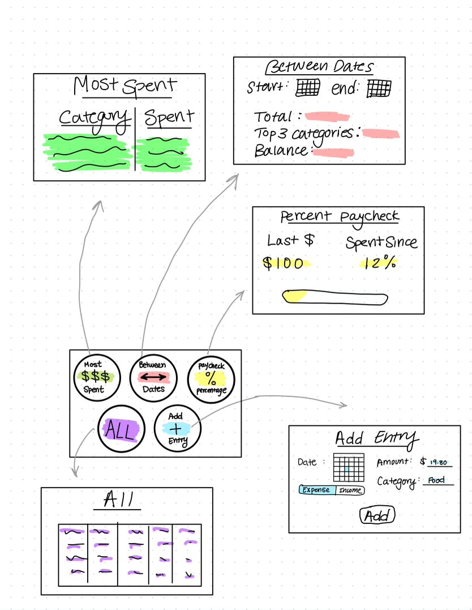

# A Web-App called BudgetBuddy

Varnit Sinha (varnits2) | Moderator: Jiaming Zhang (jz32)

This is a web-app about creating a personalized budget manager and analyzer for college students.

## Abstract

### Project Purpose

Most college students worry about their day to day spendings -- how much they spend on take out food or whether they can afford to go to that concert coming to campus. According to the US Department of Education, over 40% of full-time undergraduate students work a job, using this opportuntity to start to become financially responsible.

The purpose of this project is to introduce a personalized way to view your budget spending and breakdown. With an easy to use UI to input data, and powerful backend algorithms, the user will be able to view their spending between date ranges, as a percentage of their income, and which category they spend the most on.

### Project Motivation

When I got a job at UIUC, I always wanted to make a budget app that would specifically track spending how I needed it to. I wanted to see how much of my paycheck I was spending and hopefully gain better control over my money (and save up for loans!). I hope that through this mobile-first application I can add an aspect of financial responsibility to my life -- and so can others!

## Technical Specification

- Platform: Web
- Programming Languages: Python, JavaScript, HTML, CSS
- Frameworks: Flask/Django, React, Material-UI
- Stylistic Conventions: Python PEP-8 Style Guide, Airbnb JavaScript Style Guide
- IDE: Visual Studio Code

## Functional Specification

- Create and maintain a database of user transactions
- Perform analysis on this data based on points of interest like balance breakdown, top spending categories, spending trends, and more.
- Create a responsive website with aesthetic yet functional UI to display data and analysis results.

## Brief Timeline

- Week 1: Create database, backend endpoints, and simple CLI
- Week 2: Perform analysis, extend CLI, and start GUI
- Week 3: Extend and finish GUI, data visualization

## GUI Mockup

## Rubrics

### Week 1

| Category         | Total Score Allocated | Detailed Rubrics                                                                                                                                                                                                                                                    |
| ---------------- | :-------------------: | ------------------------------------------------------------------------------------------------------------------------------------------------------------------------------------------------------------------------------------------------------------------- |
| Database Setup   |           5           | 0: No database   +1: System setup and connection to database   +1: System writes to database without errors   +1: System reads from database without errors   +1: System reads from database based on provided condition   +1: Proper error handling |
| API              |           5           | 0: No API implementation   +1: Successful GET operations   +1: Successful POST operations   +1: Successful PUT operations   +1: Successful DELETE operations   +1: Proper error handling                                                             |
| CLI              |           5           | 0: No CLI   +1: For supporting functionality from each of GET, POST, PUT, and DELETE   +1: Proper error handling c                                                                                                                                            |
| Unit Tests       |           5           | 0: No tests   +1: For every 2 unit tests                                                                                                                                                                                                                         |
| Manual Test Plan |           5           | 0: No manual test plan   +1: For every 2 screens tested                                                                                                                                                                                                          |

### Week 2

| Category         | Total Score Allocated | Detailed Rubrics                                                                                                                          |
| ---------------- | :-------------------: | ----------------------------------------------------------------------------------------------------------------------------------------- |
| Data Analysis    |           5           | 0: No data analysis   +1: Balance breakdown   +1: Top spending categories   +2: Spending trends   +1: Proper error handling   |
| CLI Extension    |           5           | 0: No CLI extension from last week   +1: For each successful integration of data analysis options   +1: Proper error handling       |
| Basic GUI        |           5           | 0: No GUI   +1: For supporting functionality from each of GET, POST, PUT, and DELETE from previous week   +1: Proper error handling |
| Unit Tests       |           5           | 0: No tests   +1: For every 2 unit tests                                                                                               |
| Manual Test Plan |           5           | 0: No manual test plan   +1: For every 2 screens tested                                                                                |

### Week 3

| Category           | Total Score Allocated | Detailed Rubrics                                                                                                                          |
| ------------------ | :-------------------: | ----------------------------------------------------------------------------------------------------------------------------------------- |
| GUI Extension      |           5           | 0: No GUI extension   +1: For each successful integration of data analysis options from previous week   +1: Proper error handling   |
| Data Visualization |           5           | 0: No data visualization   +2: For using a third-party library for visualization   +1: For each successful data point visualization |
| Page Routing       |           5           | 0: No routing/single page application   +1: For each distinct route                                                                    |
| Unit Tests         |           5           | 0: No tests   +1: For every 2 unit tests                                                                                               |
| Manual Test Plan   |           5           | 0: No manual test plan   +1: For every 2 screens tested                                                                                |
